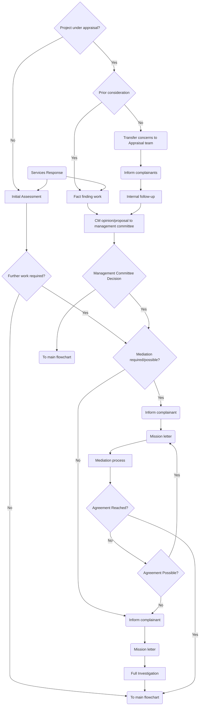

##

```mermaid
graph TD
 A{Project under appraisal?} -->|Yes| B
 A --> |No| C[Initial Assessment]
 B{Prior consideration} -->|Yes| D[Fact finding work]
 B -->|No| E(Transfer concerns to Appraisal team)
 C --> I{Further work required?}
 D --> H[CM opinion/proposal to management committee]
 E --> F(Inform complainants)
 F --> G[Internal follow-up]
 G --> H
 H --> J{Management Committee Decision}
 I --> |Yes| K{Mediation required/possible?}
 I --> |No| U
 J -->|Yes| K
 J --> L(To main flowchart)
 K -->|Yes| M(Inform complainant)
 K -->|No| P(Inform complainant)
 M --> N(Mission letter)
 N --> O[Mediation process]
 P --> Q(Mission letter)
 Q --> R[Full Investigation]
 R --> U
 O --> S{Agreement Reached?}
 S -->|No| T{Agreement Possible?}
 T --> |Yes| N
 T -->|No| P
 S -->|Yes| U(To main flowchart)
 V(Services Response) --> C
 V --> D
```
