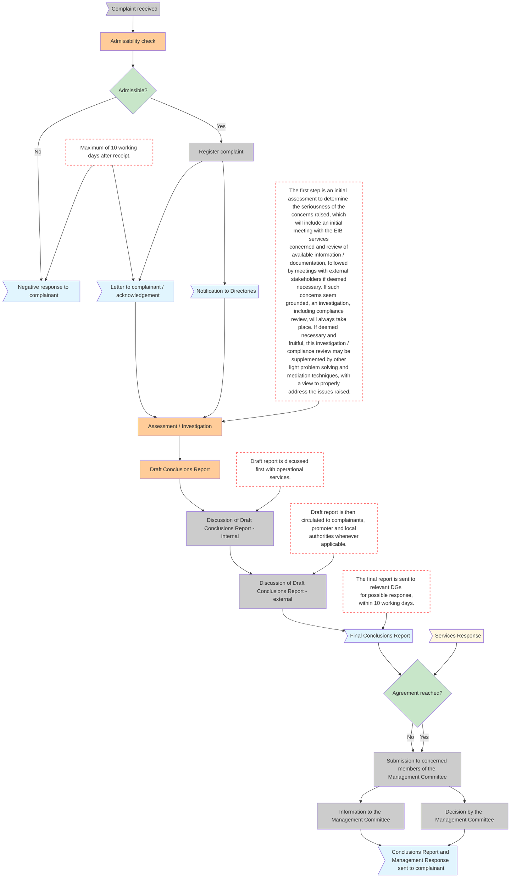

### EIB Complaints Mechanism - Flowcharts of the complaints handling process

```mermaid
graph TD
 A>Complaint received] --> B[Admissibility check]
 B --> C{Admissible?}
 C -->|No| D>Negative response to complainant]
 C -->|Yes| E[Register complaint]
 E --> F>Letter to complainant / acknowledgement]
 E --> G>Notification to Directories]
 F --> H[Assessment / Investigation]
 G --> H
 H --> I[Draft Conclusions Report]
 I --> J[Discussion of Draft Conclusions Report - internal]
 J --> K[Discussion of Draft Conclusions Report - external]
 K --> L>Final Conclusions Report]
 L --> N
 M>Services Response] --> N{Agreement reached?}
 N -->|No| O[Submission to concerned members of the Management Committee]
 N -->|Yes| O
 O --> P[Information to the Management Committee]
 O --> Q[Decision by the Management Committee]
 P --> R>Conclusions Report and Management Response sent to complainant]
 Q --> R

note1[Maximum of 10 working days after receipt.] --> D
note1 --> F

note2[The first step is an initial assessment to determine <br/> the seriousness of the concerns raised, which<br/> will include an initial meeting with the EIB services<br/> concerned and review of available information / <br/> documentation, followed by meetings with external <br/> stakeholders if deemed necessary. If such concerns seem <br/>grounded, an investigation, including compliance<br/> review, will always take place. If deemed necessary and<br/> fruitful, this investigation / compliance review may be<br/> supplemented by other light problem solving and<br/> mediation techniques, with a view to properly<br/> address the issues raised.] --> H

note3[Draft report is discussed first with operational services.] --> J

note4[Draft report is then circulated to complainants, promoter and local<br/> authorities whenever applicable.] --> K

note5[The final report is sent to relevant DGs <br/> for possible response, within 10 working days.] --> L

style note1 fill:#fff,stroke:#f66,stroke-width:2px,stroke-dasharray: 5, 5;

style note2 fill:#fff,stroke:#f66,stroke-width:2px,stroke-dasharray: 5, 5;

style note3 fill:#fff,stroke:#f66,stroke-width:2px,stroke-dasharray: 5, 5;

style note4 fill:#fff,stroke:#f66,stroke-width:2px,stroke-dasharray: 5, 5;

style note5 fill:#fff,stroke:#f66,stroke-width:2px,stroke-dasharray: 5, 5;

style A fill:#ccc
style B fill:#ffcc99
style C fill:#c8e6c9
style D fill:#e1f5fe
style E fill:#ccc
style F fill:#e1f5fe
style G fill:#e1f5fe
style H fill:#ffcc99
style I fill:#ffcc99
style J fill:#ccc
style K fill:#ccc
style L fill:#e1f5fe
style N fill:#c8e6c9
style M fill:#fff8e1
style O fill:#ccc
style P fill:#ccc
style Q fill:#ccc
style R fill:#e1f5fe
```
